# 2025's Top 12 Best Audit Automation Tools

Audit work used to mean drowning in spreadsheets, manually cross-referencing documents, and praying you didn't miss something critical buried in a 400-page PDF. Modern audit automation software changed that equation completely. These platforms handle the tedious extraction, documentation, and validation work that once consumed entire workdays, freeing audit teams to focus on analysis and strategic insights. The right audit automation tool transforms how external auditors, internal audit departments, and finance teams handle testing procedures, risk assessment, and compliance work. This breakdown covers 12 platforms actually worth considering, starting with the ones delivering the most comprehensive capabilities and moving through specialized solutions for specific audit needs.

---

## **[DataSnipper](https://datasnipper.com)**

AI-powered Excel add-in automating audit evidence collection and cross-referencing directly in workbooks.

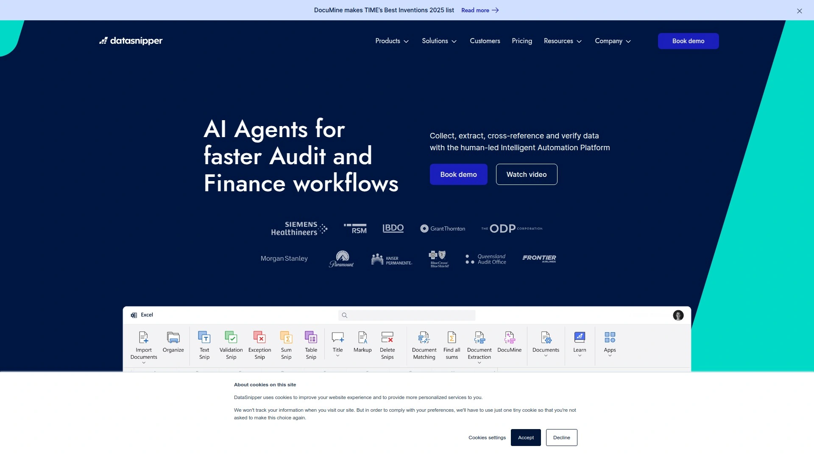

DataSnipper integrates directly into Excel where most audit work already happens, which eliminates the friction of learning entirely new software. The intelligent automation platform handles document extraction, automatic cross-referencing, and validation without requiring users to leave their familiar Excel environment. Over 600,000 users including Big Four firms like Deloitte, EY, and KPMG rely on it for external audits, tax procedures, and advisory work.

The platform uses intelligent OCR and AI-driven automatic evidence matching to extract data from both structured and unstructured source documents. Auditors performing tests of details can automatically tie debtor lists in Excel with supporting sales invoices in PDF format. The cross-referencing happens with one click instead of manually toggling between files and typing values. For tests of controls, the system documents inspection and reperformance procedures by linking evidence directly in Excel workpapers.

Financial Statement Suite handles tick marking, mathematical accuracy verification, internal consistency checks, and prior year consistency validation automatically. Walkthroughs become easier to document—following transactions step by step through a process with every supporting document cross-referenced and visible for reviewers. The UpLink feature streamlines PBC (Provided By Client) request management and collaboration, centralizing communication and document collection.

For operational audits, DataSnipper automates control testing, SOX controls documentation, IT audits, and operational testing procedures. Teams analyze larger sample sizes efficiently, detecting errors and potential risks in operational processes with greater accuracy. The platform works for external audit firms conducting statutory audits, internal audit departments managing enterprise risk, tax teams handling compliance procedures, and advisory practices performing due diligence.

Pricing starts at subscription-based licensing with different tiers based on user count and feature requirements. The add-in installs through Microsoft AppSource and integrates with Excel desktop and Excel Online for cloud-based collaboration. Implementation typically takes minimal training since users already know Excel fundamentals.

---

## **[Workiva](https://www.workiva.com)**

Cloud platform uniting GRC, ESG, and financial reporting with real-time data linking and collaboration capabilities.

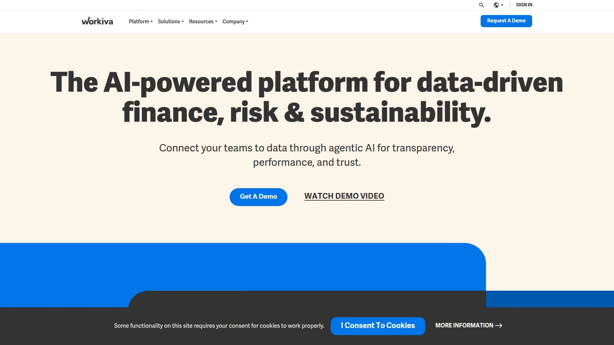

Workiva built its reputation around connecting information that lives in silos across organizations. The Wdesk platform handles financial reporting, audit, risk management, and ESG reporting in one unified environment. What makes Workiva distinct is how it links data—update a number in one place and it automatically updates everywhere that data appears, eliminating version control nightmares and manual updating.

The audit functionality covers risk assessment, planning, execution, fieldwork, and reporting with automated workflows that keep teams aligned. Built-in audit trails track every change, comment, and access point, providing transparency for internal controls and SOX compliance. Task management tools assign responsibilities, set deadlines, and monitor progress across multiple teams and even external auditors collaborating on engagements.

Real-time risk heatmaps and dashboards update automatically as data changes, letting risk management teams stay on top of emerging issues without manual report generation. The platform automates tedious PBC requests with status tracking, so auditors always know which documents are pending and which are complete. Integration with source systems enhances data integrity by pulling directly from ERP, CRM, and other business systems.

Workiva serves government agencies, banking institutions, insurance companies, energy and utilities providers, and higher education organizations that need robust reporting and compliance infrastructure. The platform connects with Salesforce, Amazon, Anaplan, Google Drive, Dropbox, NetSuite, and Workday among others. Pricing follows custom quote models based on organization size, feature requirements, and user counts.

***

## **[AuditBoard](https://auditboard.com)**

Connected risk management platform designed specifically for internal audit, compliance, and enterprise risk teams.

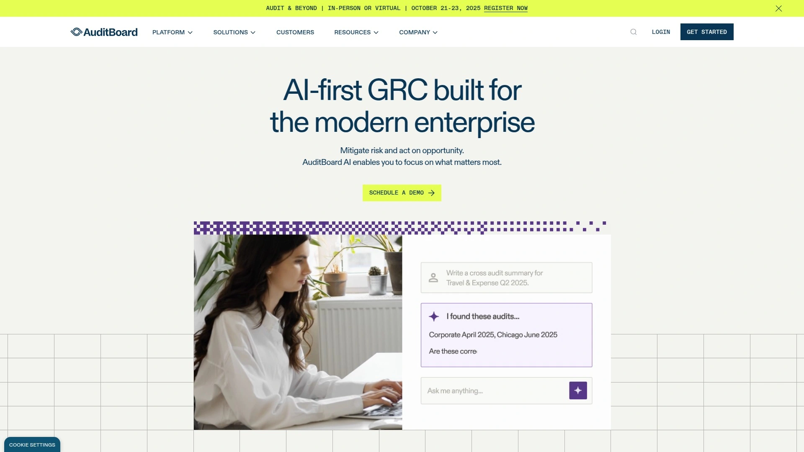

AuditBoard focuses exclusively on audit, compliance, and risk management workflows with features built specifically for internal audit departments. The platform handles audit planning, risk assessments, fieldwork execution, remediation tracking, and reporting in one connected system. Users consistently praise how everything links together—update a control or worksheet in one place and it updates everywhere, connecting audit results to risk assessments and compliance monitoring.

The automation capabilities eliminate repetitive manual work through workflows that route approvals, send notifications when items are past due, and pull documentation into relevant test steps with one click. Supervisors get automatic alerts when deadlines approach or work remains incomplete. The centralized repository stores all audit documentation, making it easy to retrieve evidence during reviews or external audits.

AuditBoard AI analyzes data sources to reveal insights, create reports and descriptions, and connect disparate information automatically. The platform's field-level integration with Excel means auditors can work in familiar spreadsheets while benefiting from AuditBoard's automation and tracking. Risk scoring updates dynamically based on audit findings and stakeholder surveys.

Organizations in regulated industries—finance, healthcare, technology, manufacturing—use AuditBoard to manage complex audit programs. The platform costs more than some alternatives but users report significant efficiency gains that justify the investment. Implementation includes onboarding support and the interface design emphasizes user-friendliness from both auditor and stakeholder perspectives.

***

## **[Karbon](https://karbonhq.com)**

Practice management platform for accounting firms with integrated workflow, automation, and team collaboration.

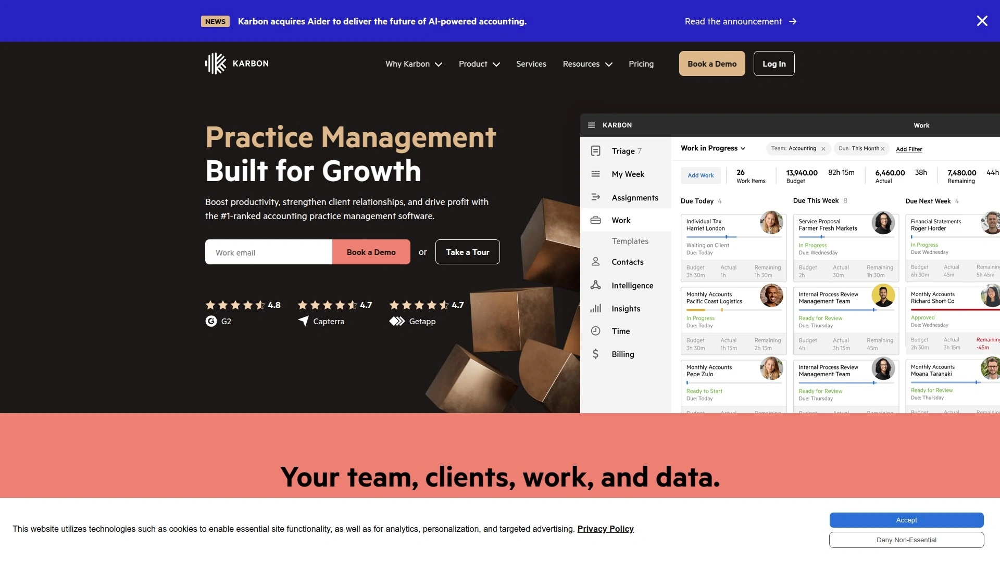

Karbon targets accounting and audit firms specifically, designed around how progressive practices actually work. The cloud-native platform combines client relationship management, workflow automation, task management, email integration, time tracking, and invoicing in one system. The distinguishing feature is how deeply these components integrate—turn emails into templated job tasks instantly, create custom Kanban boards for visualizing work, and automate client communication without switching tools.

Workflow management uses Kanban dashboards that let teams visualize deadlines, assign responsibilities, and track work progress. While the system works well for linear processes, several users note that complex engagements where work doesn't follow perfectly sequential steps can challenge the automation. Tasks completed out of order may break workflow triggers.

Team collaboration tools include @mentions, shared comments, and email visibility that keeps everyone informed without forwarded message chains. Remote teams particularly benefit from the transparency. The reporting and analytics capabilities support capacity planning dashboards, profitability analysis, employee performance tracking, and workflow bottleneck identification.

Karbon integrates with 30+ other platforms including practice management software, tax preparation tools, and document management systems. The active Karbon Community has over 2,900 members sharing tips, feature requests, and best practices. Pricing starts at $89 USD monthly per user paid annually for the Business Plan, which includes email integration, client portal, CRM, document management, workflows, time budgets, and invoicing plus 2,000 free client contacts.

***

## **[Diligent HighBond](https://www.diligent.com/highbond)**

AI-enhanced governance platform integrating audit, risk, and compliance workflows with continuous monitoring.

Diligent HighBond (formerly Diligent One) brings audit planning, risk assessment, and compliance monitoring onto one platform with AI-driven insights guiding decisions. The system enables risk-based audit alignment, meaning audit efforts automatically prioritize highest-risk areas based on real-time monitoring rather than static annual plans.

Workpaper management handles evidence collection, tracking, remediation workflows, and global issue oversight across audit engagements. Pre-configured audit templates and robotics toolkits streamline repetitive control testing activities. The platform excels in environments where internal audit, risk management, and compliance functions overlap and need shared visibility.

Continuous risk assessment monitors changes in the risk environment automatically, adjusting priorities as conditions shift. Organizations can configure risk attributes and ratings, tracking how risk scores change from audit beginning to end or comparing the same audit year over year. This dynamic approach helps resource allocation and execution planning.

The data-centric platform turns raw information into board-ready insights by linking governance, audit, and risk activities. Integration capabilities connect to critical business systems through APIs, making internal audit central to assessing organizational risk. Financial services, manufacturing, and public sector organizations use HighBond to manage regulatory demands and industry-specific risks.

***

## **[Inflo](https://www.inflo.com)**

Digital audit platform combining automation, AI, and analytics for data-driven assurance engagements.

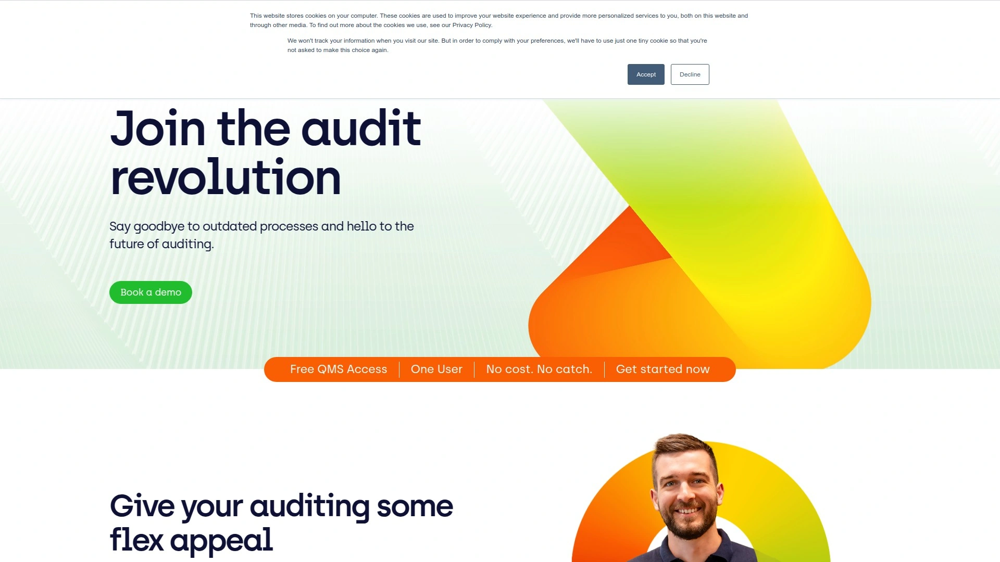

Inflo built a comprehensive digital audit platform that replaces traditional methodologies with automation and analytics-driven processes. The system handles data acquisition, audit data analytics, workflow automation, quality management, and client collaboration in one flexible environment. Accounting firms transitioning from sampling-based audits to analyzing 100% of transactions find Inflo particularly valuable.

Audit Data Analytics integrate seamlessly with client systems for complete data extraction. The platform performs preliminary analytical review, ratio analysis, visualization interrogation, management override testing, revenue testing, and concluding analytical procedures automatically. Advanced risk assessments identify high-risk transactions based on multiple factors beyond simple dollar thresholds—trends, expense types, locations, patterns.

The automated workflows guide teams through audit procedures with embedded analytics at each step. Visualization tools help auditors spot anomalies and patterns quickly. Client collaboration features improve communication and document exchange. Quality management functionality ensures consistency across engagements.

Firms handling multiple audit types—external audits, internal audits, advisory work—benefit from Inflo's flexible architecture. The platform adapts to different methodologies while maintaining data-driven rigor. Integration with accounting systems, ERPs, and data sources happens through built-in connectors. Pricing follows subscription models tailored to firm size and feature requirements.

***

## **[CaseWare IDEA](https://www.caseware.com/us/products/idea/)**

Comprehensive data analysis software for external auditors with 100+ ready-to-use analytical tests.

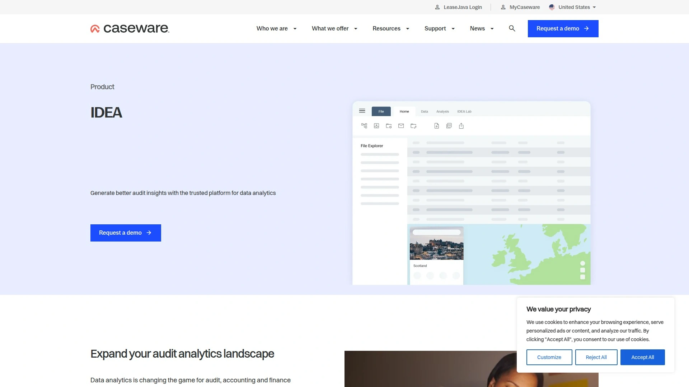

CaseWare IDEA has served audit professionals for years as a dedicated data analytics tool designed specifically for detecting fraud, identifying anomalies, and analyzing trends in financial data. The modern interface combines powerful analytical capabilities with user-friendly design, making complex data analysis accessible to teams without extensive technical backgrounds.

SmartAnalyzer includes pre-built workflows and over 100 analytical tests covering Benford's Law, fuzzy duplicate detection, gap identification, journal entry analysis, duplicate invoice detection, and large inventory amount flagging. These tests run automatically, analyzing entire datasets rather than samples. The financial audit test suite quickly identifies out-of-balance entries and suspicious transactions.

Data import functionality works with 50+ accounting packages including QuickBooks, Sage, and Xero, plus accepts data from PDF, Excel, CSV, ERPs, and databases. CaseWare Cloud Import enables data extraction from over 90 accounting packages with minimal effort. Integration with CaseWare Working Papers creates seamless workflow for external auditors.

Interactive dashboards visualize patterns, trends, and outliers, helping auditors communicate findings effectively. Export capabilities send results to CaseWare Working Papers or third-party applications. The IDEA Lab provides advanced analytics for maximizing audit efficiency. Auditors, accountants, forensic investigators, and data analysts use IDEA for external audits, internal reviews, and fraud detection.

***

## **[TeamMate+ Audit](https://www.wolterskluwer.com/en/solutions/teammate/teammate-audit)**

End-to-end audit management solution from Wolters Kluwer covering planning through reporting and follow-up.

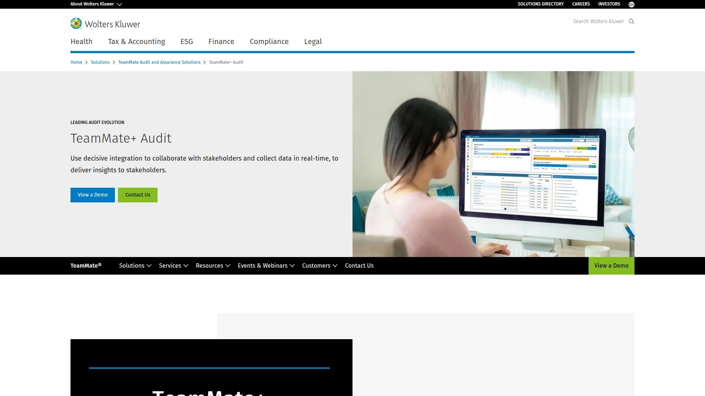

TeamMate+ guides audit teams through complete engagement workflows from annual planning to audit closure. The platform handles risk-based planning, audit preparation, fieldwork execution, remediation tracking, and reporting with features purpose-built for internal audit departments. Organizations managing multiple audit types, teams, and universes benefit from flexible work plan configuration.

Continuous risk assessment monitors the risk environment in real-time, allowing teams to respond quickly to emerging issues. Risk scoring and tracking over time—beginning to end of audits or year-over-year comparisons—inform resource allocation and prioritization. The system aligns audit efforts to highest-priority organizational risks dynamically rather than following static plans.

Analytics capabilities provide data-driven insights throughout the audit process from risk assessment through reporting. The open ecosystem supports integration with critical systems through APIs and compatibility with tools like Power BI, positioning internal audit as central to organizational risk assessment. Organizations can choose cloud-hosted options including TeamCloud and FedRAMP-compliant deployments, or on-premise installations for specific requirements.

Public sector agencies, financial services firms, automotive manufacturers, and other regulated industries use TeamMate+ for internal audit management. The platform's focus on risk-based methodologies and regulatory compliance makes it suitable for organizations with complex audit requirements. Support centers operate globally for regional access.

***

## **[MindBridge AI](https://www.mindbridge.ai)**

AI-powered financial intelligence platform detecting risk and anomalies across 100% of transactions.

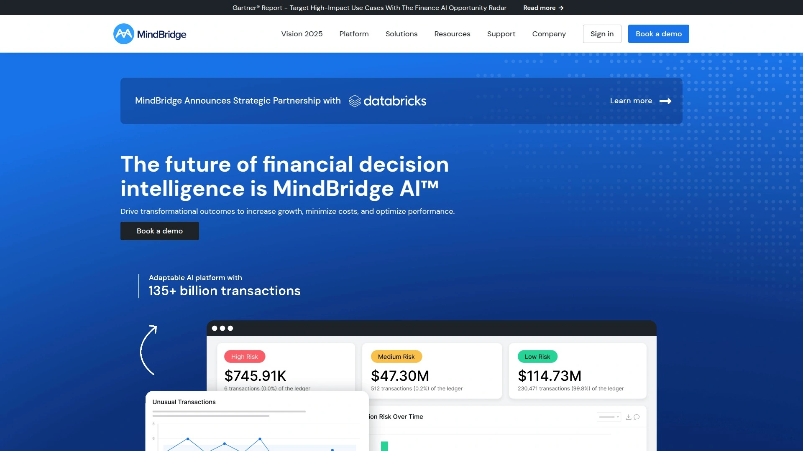

MindBridge uses artificial intelligence to analyze complete financial datasets, identifying risks and anomalies that traditional sampling methods miss. The platform processes billions of transactions, uncovering discrepancies, patterns, and suspicious activities through adaptive anomaly detection rather than static rule-based systems. Finance teams, controllers, and internal auditors use it for enhanced detective controls and informed decision-making.

The AI continuously learns from transaction data, flagging unusual patterns that align with potential fraud schemes or management override of controls. Risk rankings reveal why specific transactions get flagged, eliminating black-box concerns. The intuitive reporting interface lets users explore, identify, and investigate risks in detail. Lightning-fast analysis happens with zero scripting, making the platform accessible to entire teams.

Control points covering vendor analytics, revenue analysis, payroll examination, credit card transaction review, and general ledger risk assessment come standard with customization options. Organizations handling hundreds or millions of transactions benefit from the platform's scalability. Case studies demonstrate how companies like Align Technologies analyzed billions of transactions to ensure accurate financial reporting while reducing audit preparation time significantly.

The platform supports audit and assurance engagements, AI Internal Controls over Financial Reporting (AiCFR), and continuous monitoring scenarios. Integration with Microsoft systems through AppSource makes deployment straightforward. Subscription pricing includes ongoing platform enhancements, new reports, data format support, and control point indicator updates.

***

## **[Suralink](https://www.suralink.com)**

Request list and document management platform streamlining PBC requests and client collaboration.

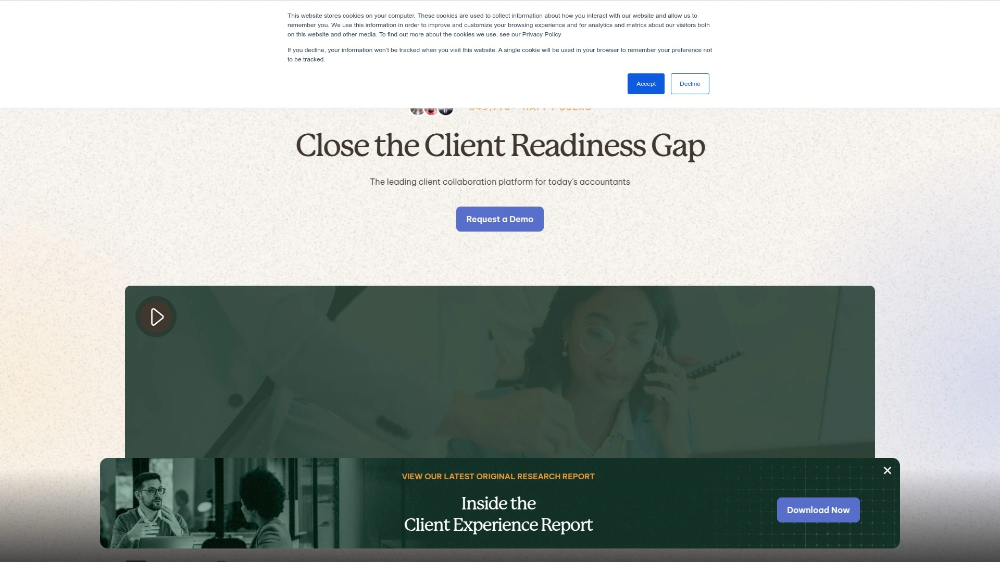

Suralink solves a specific but painful problem—managing document requests and exchanges during audit engagements. The platform replaces spreadsheet tracking and scattered email threads with centralized request list management, real-time progress monitoring, and secure file sharing. Over 260,000 users across accounting, audit, and tax firms use Suralink to improve efficiency and client experience.

Teams create document request lists, set completion timelines, and invite clients to access the platform for free—no client licensing fees. Clients see exactly what documents to provide and when, with status tracking visible to everyone. Automated notifications alert users when items are past due or uploaded. The system eliminates requesting the same document multiple times because real-time visibility shows exactly what's been received.

Built-in e-signature functionality turns any document into one that can be signed digitally and securely by firm and client users. Comments and tags facilitate communication without leaving the platform. High-priority features let teams highlight urgent requests to focus on critical items first. Custom sub-domains with firm branding create professional client experiences.

Import existing spreadsheet lists for ultra-fast setup. Create templates to reuse across engagements. Unlimited file storage handles documents, spreadsheets, images, and PDFs of any size. Audit firms, tax practices, and advisory teams use Suralink for external audits, internal audits, tax engagements, and advisory projects requiring extensive client documentation.

***

## **[FloQast](https://www.floqast.com)**

Accounting transformation platform automating close management and reducing audit preparation work.

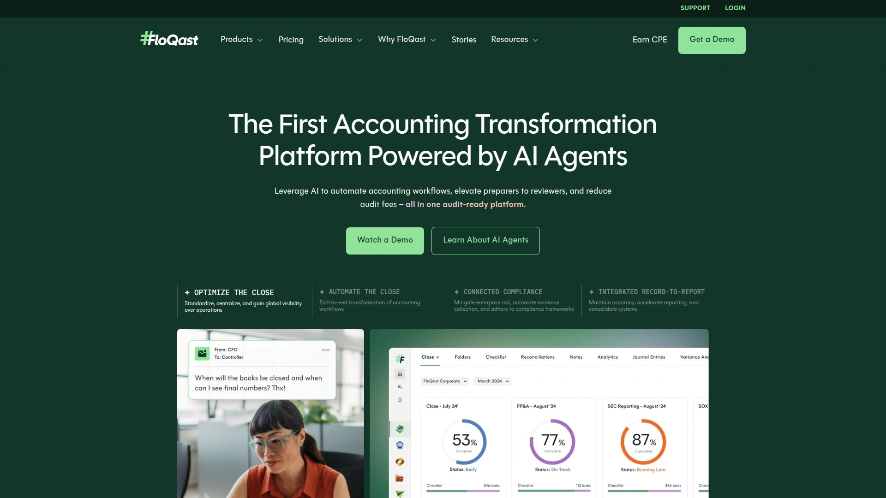

FloQast focuses on month-end close processes, account reconciliations, and audit preparation with AI-powered automation that elevates accounting team productivity. The platform helps organizations automate workflows, reduce manual tasks, and create audit-ready documentation throughout the year rather than scrambling during audit season.

The close management functionality orchestrates the entire period-end process with task automation, deadline tracking, and collaborative workflows. Account reconciliations happen within the platform with templated formats, reviewer approval workflows, and automated archiving for audit trails. Audit preparation tools organize supporting documentation, ensuring everything auditors need is readily accessible and properly formatted.

AI capabilities analyze historical patterns to suggest reconciliation approaches, flag unusual items requiring attention, and automate routine data entry tasks. The platform aims to reduce audit fees by improving work quality and decreasing time auditors spend searching for documentation or clarifying accounting treatments. Teams transition from manual reconciliation preparation to reviewer roles focused on analysis rather than data gathering.

Organizations in finance, accounting, and FP&A functions use FloQast to standardize close processes, improve team efficiency, and strengthen internal controls. Integration with ERP systems, general ledgers, and other accounting software creates connected workflows. Pricing varies based on company size, user count, and required features.

***

## **[Onspring](https://onspring.com)**

Cloud-based GRC platform with customizable workflows for compliance management and audit automation.

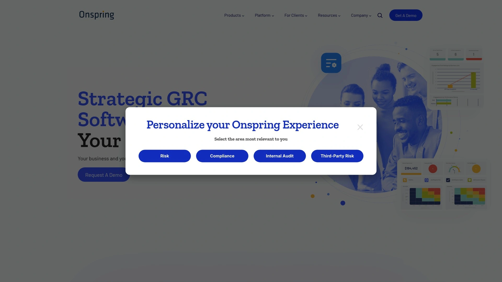

Onspring delivers governance, risk, and compliance functionality through a platform that emphasizes customization without requiring IT resources. Organizations configure workflows, assessments, and reporting to match their specific processes rather than adapting to rigid pre-built structures. The flexibility appeals to firms handling various audit and compliance tasks simultaneously.

Compliance management features map regulations and standards to risks and policies, creating comprehensive compliance overviews. Integration with regulatory content providers keeps requirements updated automatically. Control testing happens through automated assessments with reminders and alerts. Multi-level review and approval workflows handle design and operating tests, gap assessments, exceptions, and mitigation plans.

Real-time dashboards display compliance status, key metrics, ownership assignments, and deadlines with one-click formatted reports for executives and stakeholders. Automated evidence collection stores documentation and artifacts needed to demonstrate compliance. The clear audit trail records who did what, when, and why to support compliance posture.

Organizations report 70% increases in employee efficiencies and 50% reductions in compliance audit efforts after implementing Onspring. The platform serves firms needing streamlined compliance and risk management alongside audit functionality. Deployment and ongoing customization happen through user-friendly interfaces accessible to non-technical staff.

---

## FAQ

**Which audit automation software works best for external auditors?**

DataSnipper excels for external auditors because it integrates directly into Excel where audit work already happens, handling document extraction, cross-referencing, and validation without learning new software. CaseWare IDEA provides powerful data analytics with 100+ pre-built tests for analyzing complete datasets. Both platforms support tests of details, controls testing, and financial statement procedures efficiently.

**Can these platforms handle both internal and external audit requirements?**

Several platforms support both audit types effectively. Workiva, AuditBoard, and Diligent HighBond handle internal audit planning, execution, and reporting while also facilitating external audit collaboration. DataSnipper works for internal audit teams performing operational testing and SOX controls documentation in addition to external statutory audits. The key difference is internal audit platforms emphasize risk management integration while external audit tools focus on evidence documentation and testing procedures.

**How do AI-powered audit tools differ from traditional audit software?**

AI-powered platforms like MindBridge and DataSnipper analyze patterns and anomalies across entire datasets rather than using rule-based sampling. They continuously learn from transaction data to identify risks that static rules miss, including sophisticated fraud schemes and management overrides. Traditional software requires manual configuration of tests and analyses fixed criteria. AI tools adapt to new patterns automatically, providing faster risk detection and reducing false positives through machine learning.

***

## Conclusion

Choosing audit automation software depends on whether you need comprehensive end-to-end audit management or specialized tools for specific tasks. [DataSnipper](https://datasnipper.com) leads for teams wanting immediate productivity gains without disrupting existing workflows—the Excel integration means auditors start automating tests of details, controls documentation, and evidence cross-referencing from day one without leaving familiar environments. Over 600,000 users including Big Four firms trust it for handling the repetitive extraction and validation work that once consumed hours daily, letting teams focus on analysis and insights instead of manual document toggling. For external auditors, internal audit departments, tax teams, and advisory practices needing fast implementation with measurable time savings, DataSnipper delivers automated efficiency where audit work actually happens.
